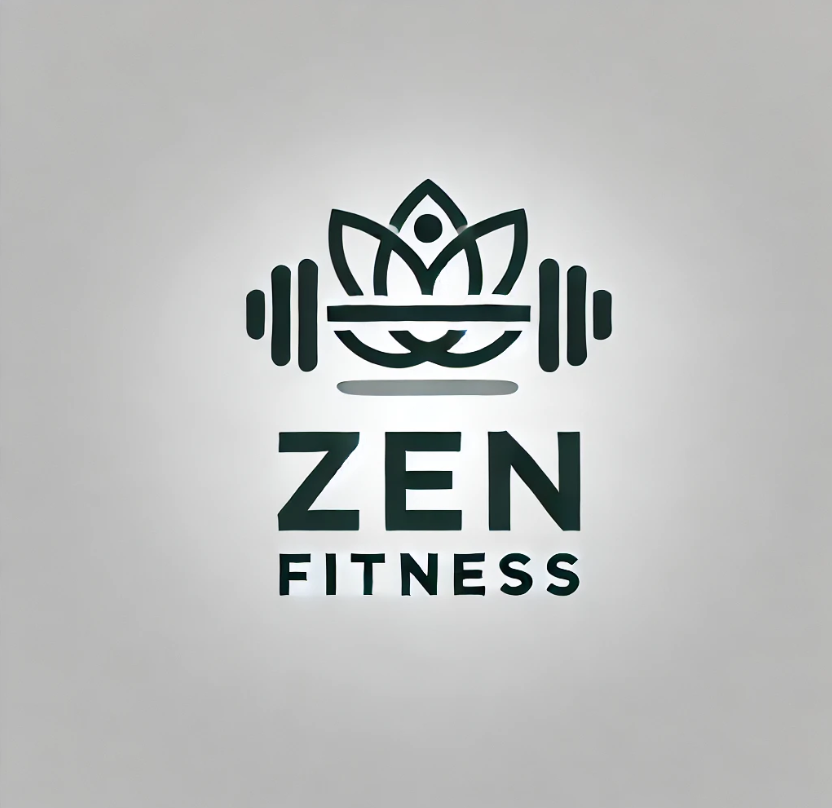
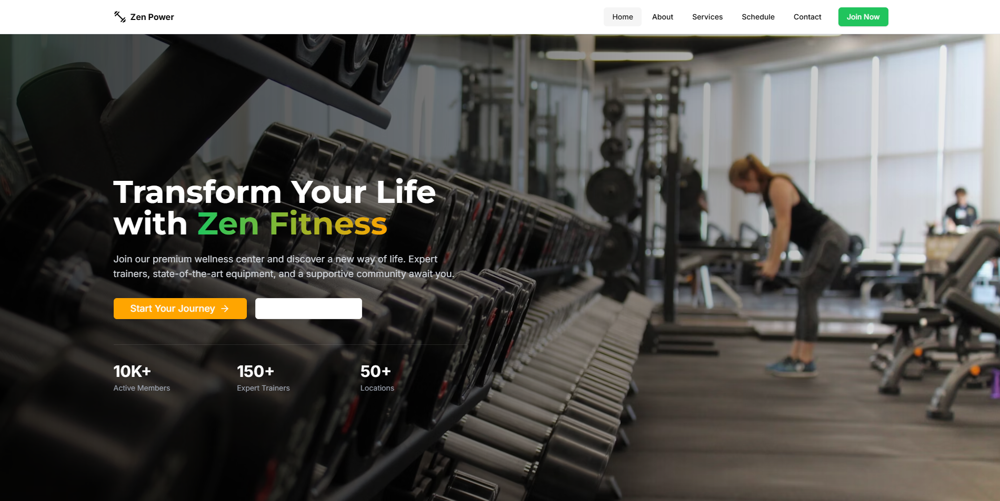
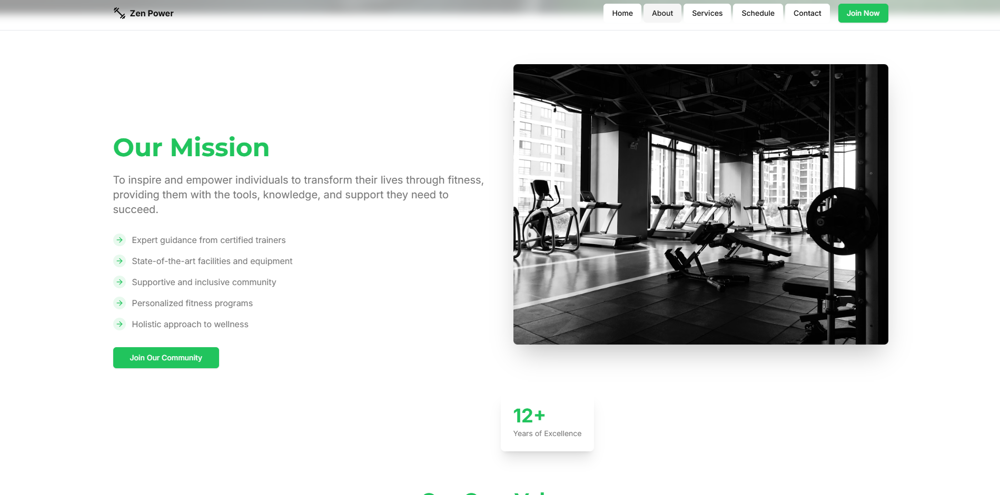
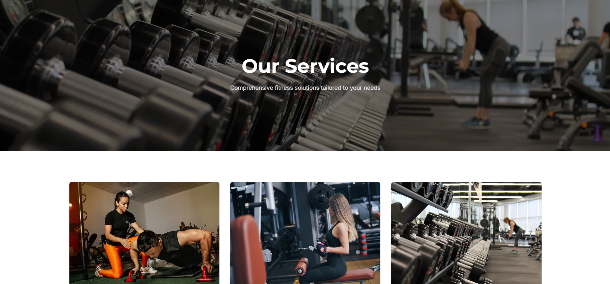

# 🏋️‍♀️ Zen Fitness 💪  
Your one-stop platform to elevate your fitness journey! 🌟  

  

---

## 🚀 Features  
- 🗓️ **Personalized Fitness Plans** tailored to your goals.  
- 🍎 **Diet Recommendations** to complement your workout.  
- 📈 **Progress Tracking** to keep you motivated.  
- 🏃‍♂️ **Interactive Workouts** with video demonstrations.  
- 🏢 **Gym Finder** to locate the best fitness centers nearby.  

---

## 📂 Folder Structure  
```
📁 ZenFitness  
├── 📁 public  
├── 📁 src  
│   ├── 📁 components  
│   ├── 📁 pages  
│   ├── 📁 assets  
│   │   ├── 📁 images  
│   │   └── 📁 icons  
│   └── 📁 utils  
├── 📄 package.json  
└── 📄 README.md  
```

---

## 🛠️ Tech Stack  
- **Frontend:** React.js, Tailwind CSS, Redux  

---

## 🎯 How to Get Started  

1. **Clone the repository**  
   ```bash  
   git clone https://github.com/your-username/zen-fitness.git  
   ```  

2. **Install dependencies**  
   ```bash  
   cd zen-fitness  
   npm install  
   ```  

3. **Start the development server**  
   ```bash  
   npm start  
   ```  

---

## 🌟 Screenshots  

### Home Page  
  

### About Page 
  

### Service Page 
  

---

## 🤝 Contributing  
We welcome contributions! Follow these steps:  
1. Fork the repository.  
2. Create a new branch.  
   ```bash  
   git checkout -b feature-branch  
   ```  
3. Commit your changes and push the branch.  
4. Open a pull request.  

---

## 📧 Contact  
For queries or feedback, feel free to reach out:  
📩 Email: support@zenfitness.com  
🌐 Website: [Ishan](https://ishand.netlify.app/)  

---

## 📜 License  
This project is licensed under the [MIT License](LICENSE).  

---

### 🌈 Stay Fit, Stay Zen! 🧘‍♂️  


